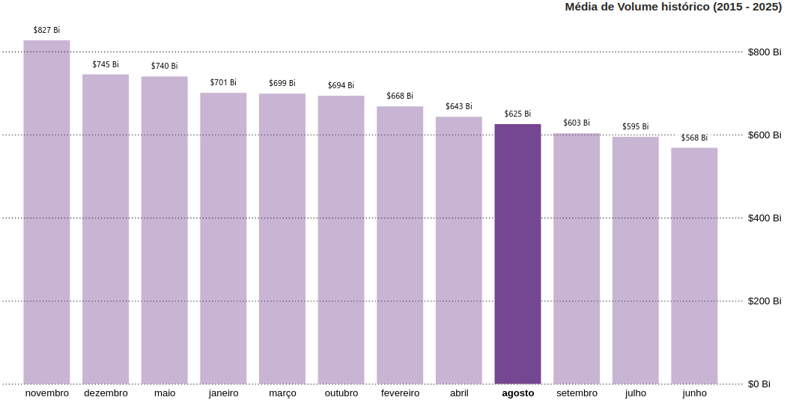

# Análise de Padrões Temporais no Bitcoin: Análise sazonal e Volatilidade Mensal
> A motivação do mercado para as quedas de agosto

## 📌 Visão Geral
Este repositório apresenta uma análise do Bitcoin a fim de desmistificar o comportamento por trás das quedas no mês de agosto, realizando triangulação de dados históricos e análise on-chain.

## As constantes quedas em agosto e o evento 'Sell in may and go away'
Durante o projeto, é apresentada uma das hipóteses que investidores e analistas mais usam para explicar as quedas em agosto, o 'Sell in may and go away'. Com o decorrer da análise, é apresentada uma hipótese mais forte e que complementa a explicação do evento em questão, quebrando a narrativa pura, simplificada e quase mística da teoria. 

## ⚙️ Arquitetura de Dados e Metodologia
**Tratamento:** Para garantir a qualidade do projeto, foi necessário o uso de truncamento temporal e sanitização de outliers para garantir a simetria da amostra. Foi usado cruzamento de dados de diferentes fontes para a mitigação de inconsistências e cálculo de variação líquida.  
**Fontes:** 
[Yahoo Finance](https://finance.yahoo.com/quote/BTC-USD/history/)
[Investing.com](https://www.investing.com/crypto/bitcoin/historical-data)
[CoinMarketCap](https://coinmarketcap.com/currencies/bitcoin/historical-data/)
[CoinGecko](https://www.coingecko.com/en/coins/bitcoin/historical_data)

## 💡 Principais Descobertas
1. Agosto teve 9 recorrências de queda e apenas 2 de alta em 11 anos.
2. Agosto é o 4° pior mês em volume de negociação historicamente, atrás apenas de setembro, julho e junho.
3. Há uma rotação interna de carteiras entre baleias (carteiras com mais de 1.000 bitcoins) e tubarões (carteiras entre 100 bitcoins a 999 bitcoins) no mês de agosto por meio de negociações OTC (Over-The-Counter).
4. O fator principal das quedas no mês de agosto não é apenas uma pressão vendedora, mas a falta de liquidez e de grandes ordens nos livros de ofertas das corretoras.

## 📂 Estrutura do Repositório e Como Navegar
* `notebooks/`: Diretório contendo todos os notebooks usados na análise.
* `notebooks/teses_e_rascunho.ipynb`: Documento contendo as teses, ideias e rascunhos usados na montagem da análise.
* `docs/images/`: Imagens usadas na análise.
* `docs/analise_de_padroes_temporais.md`: Markdown contendo a análise completa.
* `processed/` e `raw/`: Diretórios contendo os datasets processados e crus.
* `docs/dashboard/`: Diretório contendo arquivo .pbix, pdf e vídeo demonstrando as interações

## Dashboard
O dashboard foi criado usando o power BI. É possível encontrar o arquivo .pbix e o pdf apresentando todos os slides em `docs/dashboard`.

## Tecnologias usadas
- Python + Pandas: exploração, limpeza, transformação e análise dos dados.
- Jupyter Notebook: desenvolvimento iterativo e validação das hipóteses.
- Plotly Express: visualizações exploratórias durante a investigação.
- Power BI: construção do dashboard para apresentação dos resultados.