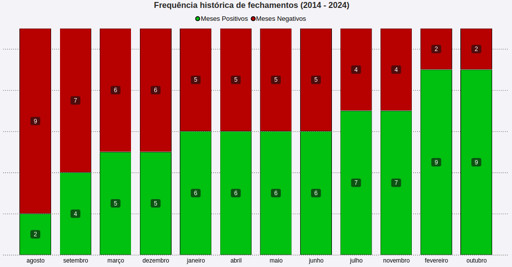
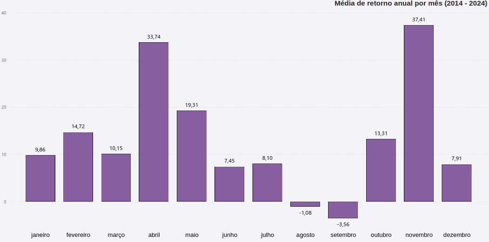
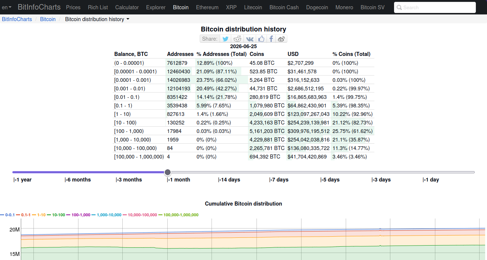

## Análise de Padrões Temporais no Bitcoin: Análise sazonal e Volatilidade Mensal  

No mercado de criptomoedas é comum ouvir investidores e analistas afirmarem que agosto tende a ser um mês de queda e que não é algo que se deve temer, mas raramente trazem uma explicação para isso.  
Esta análise tem como finalidade mostrar até onde essa afirmação é verdadeira e apresentar os motivos por trás disso. Para isso, foram usados três datasets de diferentes fontes: CoinMarketCap, CoinGecko e Investing.com. Como cada dataset contém dados de tempo de início e fim assimétricos, serão usados períodos flexíveis para cada tipo de análise feita. Esse truncamento intencional garante o nivelamento das amostras e a preservação do rigor estatístico.  
Também foram utilizadas notícias que ocorreram no mercado de Bitcoin e das criptomoedas e dados on-chain, a fim de mitigar inconsistências e validar a integridade das métricas através da triangulação de fatos históricos.
    
**Agosto é realmente um mês fraco historicamente?**

Sim, agosto tende a ser um mês estatisticamente fraco.  
Ao analisar os dados contidos nos datasets, de 2014 a 2024, o mês de agosto variou negativamente 9 vezes e apenas 2 vezes positivamente, tendo uma média de -1,08% de retorno ao longo dos anos, sendo o mês com maior recorrência de fechamentos negativos. Há também outros três meses que costumam fechar em baixa: março, setembro e dezembro. Setembro é o segundo mês com mais recorrências (7 recorrências) e o pior retorno com média de -3,56%. Por mais que março e dezembro sejam meses em que houve muitos fechamentos negativos, a média de desempenho deles ao longo dos anos não foi negativa assim como agosto e setembro, sendo de 10,15% para março e 7,91% para dezembro.  

  
  

**Mas o que explica esse comportamento?**

É possível encontrar tópicos e artigos relatando sobre um evento no mercado financeiro chamado "Sell in may and go away", assim como é ilustrado na matéria da [InfoMoney](https://www.infomoney.com.br/mercados/sell-in-may-and-go-away-o-que-significa-esse-velho-ditado-do-mercado/).  
Esse evento consiste na saída dos investidores dos mercados e a venda de seus ativos durante o mês de maio a setembro migrando muitas vezes para a renda fixa pois acreditam que o desempenho é em média mais baixo nesse período comparado à taxa de juros, isso deixa os ativos com baixa liquidez, tornando-os mais voláteis e propícios a reagir de forma agressiva com notícias.  
Esse evento ocorre em praticamente todo o hemisfério norte e se potencializa com as férias de muitos investidores e corretores do mercado financeiro. Muitos analistas do mercado de criptomoedas usam esse evento como motivo para o mau desempenho de agosto. Para verificar a tese, foram analisados dados históricos de preço, volume e market cap, dados on-chain e também notícias históricas do Bitcoin.  
Ao realizar o cálculo de média histórica dos meses, percebe-se que há diferenças que indicam que essas quedas são movimentos ocasionados por baixa liquidez. Historicamente, agosto tende a ser o 4° pior mês em volume, mas isso não comprova que esse evento é o causador desse padrão, muito menos se é o fator principal ou um agente secundário.  
  
   
  
Isso comprova que a liquidez de fato diminui durante as férias institucionais, mas a baixa liquidez não é o causador isolado da queda, ela é apenas a consequência que cria uma fragilidade no livro de ofertas. É a partir dessa fragilidade que o verdadeiro causador da volatilidade entra em ação.

### A hipótese 

Uma das hipóteses é a de que instituições, fundos e grandes investidores negociam Bitcoin entre si por meio do mercado OTC (over-the-counter), o que gera uma falta de ordens limitadas e liquidez no mercado de varejo.

**Primeiro, o que é o mercado OTC (Over-The-Counter)?**

Mercado OTC é um ambiente descentralizado onde os ativos são negociados diretamente entre as partes. No caso de criptomoedas, pode ser feita através de corretoras como Binance, Coinbase ou diretamente entre as partes, o chamado wallet to wallet, sendo uma forma anônima de negociação.
Por mais que seja possível contabilizar o volume negociado nesse mercado quando negociado através de corretoras, esse volume não é levado em conta no preço do Bitcoin e das criptomoedas pois não entra no livro de ofertas das corretoras, não influenciando o preço do ativo diretamente. Como o mercado OTC utiliza o preço de varejo como base, ele atua como um amortecedor de grandes ordens, se as instituições e megabaleias precisam realizar vendas e movimentações massivas de capital durante esse período sazonal, elas não utilizam o livro de ofertas público para não derrubarem o preço do ativo, prejudicando a si mesmas, por isso migram essas transações gigantescas diretamente para o OTC.

### Comportamento das carteiras de megabaleias e tubarões

Para verificar se há ou não uma saída definitiva de capital, indo contra a hipótese apresentada, foram extraídos dados históricos de distribuição de Bitcoins por faixas de carteiras no site [BitInfoCharts](https://bitinfocharts.com/bitcoin-distribution-history.html) e realizado o cálculo para a obtenção da variação líquida (Delta).    
Como infelizmente o [BitInfoCharts](https://bitinfocharts.com/bitcoin-distribution-history.html) não permite a visualização histórica além de um ano atrás, será necessário o uso de ferramentas como o [Internet Archive](https://web.archive.org) para pegar amostras de dados antigos mas limitados até 2022.  
  
    

Amostra histórica do cálculo Delta:

*Agosto de 2023 (Período de 31/07/2023 a 01/10/2023)*

Carteiras de 1.000 a 10.000 BTC (Megabaleias): O saldo inicial era de 4.685.541 BTC e finalizou em 4.698.863 BTC, um aumento de +13.322 BTC. 
Carteiras de 100 a 1.000 BTC (Tubarões): O saldo inicial era de 3.879.853 BTC e finalizou em 3.870.946 BTC, diminuição de -8.907 BTC.

Nota: Se formos isolar apenas o mês de agosto, do dia 31/07 ao dia 01/09, as baleias acumularam +5.622 BTC e os tubarões diminuíram -22.561 BTC, o que indica um cenário de estabilidade institucional e lateralização, sem fuga de capital.

*Agosto de 2024 (Período de 04/08/2024 a 05/09/2024)*

Carteiras de 1.000 a 10.000 BTC (Megabaleias): O saldo inicial era de 4.785.754 BTC e finalizou em 4.760.180 BTC. Movimento de -25.574 BTC.  
Carteiras de 100 a 1.000 BTC (Tubarões): O saldo inicial era de 3.936.981 BTC e finalizou em 4.012.421 BTC. Mudança de +75.440 BTC.

*Agosto de 2025 (Período de 04/08/2025 a 08/09/2025)*

Carteiras de 1.000 a 10.000 BTC (Megabaleias): O saldo inicial era de 4.370.961 BTC e finalizou em 4.353.773 BTC, -17.188 BTC.  
Carteiras de 100 a 1.000 BTC (Tubarões): O saldo inicial era de 4.908.496 BTC e finalizou em 4.964.941 BTC, +56.445 BTC.

É perceptível que ao aplicar o cálculo da variação líquida (Delta) sobre o volume de moedas de cada categoria, os resultados mostram que o movimento é uma rotação interna de carteiras, e não um despejo massivo. Em 2024, o recuo de mais de 25 mil moedas das maiores carteiras foi absorvido pelo aumento de mais de 75 mil moedas na faixa dos tubarões, deixando o balanço institucional no positivo. Assim como em 2025 e em 2023, mas nesse caso sendo o inverso.

***E onde estão as sardinhas (varejo) nisso tudo?***

No mesmo período de agosto de 2024, enquanto os tubarões engoliram dezenas de milhares de moedas, o varejo global obteve um acréscimo irrelevante de apenas +3.496 BTC. Isso se repete em outros ciclos como 2025 e 2023. Em termos de microestrutura, o acúmulo das sardinhas é marginal e estatisticamente incapaz de ditar a movimentação do gráfico ou absorver despejos. Nesse caso, o papel do varejo entra como um dos causadores da queda pois, por ser formado por muitos investidores sem experiência e com menos dinheiro, acaba sendo mais sensível a notícias e oscilações agressivas do preço, além de cogitar ir para meios mais seguros para conseguir aumentar patrimônio.  

O bear market do Bitcoin nunca começou em agosto se for levado em conta o primeiro mês na história com variação negativa. Isso pode sugerir que, mesmo sendo um mês em que ocorrem bastantes quedas, não é um mês onde os investidores realizam lucro e param de comprar o ativo esperando recomprar em possíveis fundos. Não houve força vendedora suficiente no mês de agosto até agora para que ocorra um bear market. Historicamente, após um corte de oferta de recompensas para os mineradores do Bitcoin (halving), o preço tem uma disparada por em média um ano a partir do ano do halving, e em todos os anos que isso ocorreu, foram em meses onde agosto ainda estaria no meio desse período médio de um ano.
